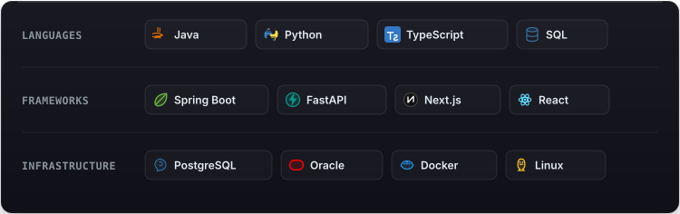

  

  

<picture>
  <source media="(prefers-color-scheme: dark)" srcset="./assets/profile-card.svg" />
  <source media="(prefers-color-scheme: light)" srcset="./assets/profile-card-light.svg" />
  
</picture>

# Wali Ahed Hussain

**Systems Architect & Founder-Engineer**

Make state explicit. Make failure observable. Make guarantees testable.

 

<!-- Custom Glassmorphic Action Buttons -->

  <a href="mailto:waliahed05@gmail.com" target="_blank">
    <picture>
      <source media="(prefers-color-scheme: dark)" srcset="./assets/buttons/email-dark.svg" />
      <source media="(prefers-color-scheme: light)" srcset="./assets/buttons/email-light.svg" />
      
    </picture>
  </a>
  &nbsp;&nbsp;
  <a href="https://www.linkedin.com/in/wali-ahed-hussain-41b549252/" target="_blank">
    <picture>
      <source media="(prefers-color-scheme: dark)" srcset="./assets/buttons/linkedin-dark.svg" />
      <source media="(prefers-color-scheme: light)" srcset="./assets/buttons/linkedin-light.svg" />
      
    </picture>
  </a>
  &nbsp;&nbsp;
  <a href="https://github.com/Wali05" target="_blank">
    <picture>
      <source media="(prefers-color-scheme: dark)" srcset="./assets/buttons/github-dark.svg" />
      <source media="(prefers-color-scheme: light)" srcset="./assets/buttons/github-light.svg" />
      
    </picture>
  </a>

 

<!-- Glassmorphic Systems & Stack Showcase Card -->

  <picture>
    <source media="(prefers-color-scheme: dark)" srcset="./assets/systems-card.svg" />
    <source media="(prefers-color-scheme: light)" srcset="./assets/systems-card-light.svg" />
    
  </picture>

 

### Now

Exploring developer tooling around failure diagnosis — building systems that reconstruct execution state, environment delta, and repository context when a command fails, explaining *why* it broke rather than dumping raw stderr.

 

<picture>
  <source
    media="(prefers-color-scheme: dark)"
    srcset="https://raw.githubusercontent.com/Wali05/Wali05/output/github-snake-dark.svg"
  />
  <source
    media="(prefers-color-scheme: light)"
    srcset="https://raw.githubusercontent.com/Wali05/Wali05/output/github-snake.svg"
  />
  
</picture>

build → break → understand → rebuild

 

  

