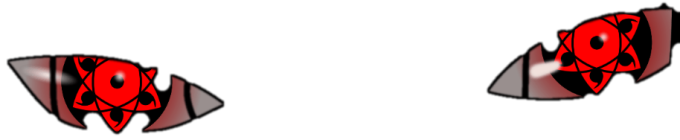

<div align="center">
  
</div>

<div align="right">
  
</div>

<div align="center">


# <font color="#ffffff">Wali Ahed</font> <font color="#e60012">Hussain</font>

**<font color="#ff4d4f">Backend Systems</font> &nbsp;·&nbsp; <font color="#ffffff">Distributed Systems</font> &nbsp;·&nbsp; <font color="#ff4d4f">Developer Infrastructure</font>**

*<font color="#8b949e">I build software that stays understandable when the happy path disappears.</font>*

<br>

<a href="mailto:waliahed05@gmail.com"><font color="#ff4d4f"><b>Email</b></font></a>
&nbsp;&nbsp;·&nbsp;&nbsp;
<a href="https://www.linkedin.com/in/wali-ahed-hussain-41b549252/"><font color="#ffffff"><b>LinkedIn</b></font></a>
&nbsp;&nbsp;·&nbsp;&nbsp;
<a href="https://www.wali.codes/"><font color="#ff4d4f"><b>Portfolio</b></font></a>
<a href="https://github.com/Wali05?tab=repositories"><font color="#ff4d4f"><b>Repositories</b></font></a>


</div>

<br>

### Now

Building developer tooling that reconstructs context around failed commands — not just **what** failed, but **what changed and why**.

<br>

<div align="center">

`make state explicit` &nbsp;·&nbsp; `make failure observable` &nbsp;·&nbsp; `make guarantees testable`

<br><br>

<picture>
  <source media="(prefers-color-scheme: dark)" srcset="./assets/systems-trace.svg" />
  <source media="(prefers-color-scheme: light)" srcset="./assets/systems-trace-light.svg" />
  
</picture>

</div>

<br>

```text
• Languages       Java · Python · TypeScript · SQL
• Frameworks      Spring Boot · FastAPI · Next.js · React
• Infrastructure  PostgreSQL · Oracle · Docker · Linux
```

<br>

<div align="center">



<br><br>

<picture>
  <source
    media="(prefers-color-scheme: dark)"
    srcset="https://raw.githubusercontent.com/Wali05/Wali05/output/github-snake-dark.svg"
  />
  <source
    media="(prefers-color-scheme: light)"
    srcset="https://raw.githubusercontent.com/Wali05/Wali05/output/github-snake.svg"
  />
  
</picture>

<br>

<sub>build → break → understand → rebuild</sub>

</div>

<br>

<div align="center">
  
</div>
